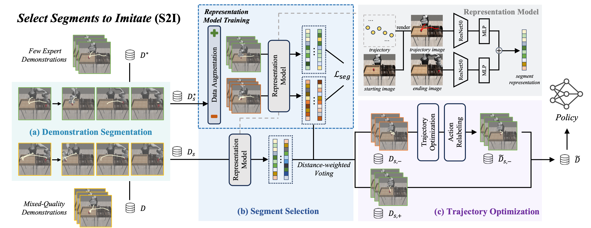

# Towards Effective Utilization of Mixed-Quality Demonstrations in Robotic Manipulation via Segment-Level Selection and Optimization

[[Paper]](https://arxiv.org/pdf/2409.19917) [[Project Page]](https://tonyfang.net/s2i/) 



## 🧑🏻‍💻 Run
For the representation model training stage, run the command `bash command_train.sh` to execute the data training script, which will preprocess the dataset and training the model. 

Here are the argument explanations in the training process:
* `--dataset` : Specifies the entire dataset used for the representation model training.
* `--aug_path` : The path where the results of the augmented dataset will be stored. 
* `--save_mode` ：Indicates the format or type of the dataset.
* `--size` : Specifies the size to which the images will be resized.
* `--numbers` ：The index or specific identifier used for data augmentation within the dataset. 

For the eval stage, run the command `bash command_eval.sh` to complete the segment selection and trajectory optimization processes.

Here are the argument explanations in the evaluation process:
* `--train_data_folder` :  The dataset used for distance-weighted voting during the segment selection process.
* `--val_data_folder` : The folder containing the full mixed-quality demonstration dataset for validation.
* `--size` : Specifies the size to which the images will be resized.

## 🤖 Training Manipulation Policy

After Select Segments to Imitate (S2I), the dataset can be directly used for downstream manipulation policy training as a plug-and-play solution.

For simulation experiments, we use the state-based [BC-RNN](https://github.com/ARISE-Initiative/robomimic) and the [Diffusion Policy (DP)](https://github.com/real-stanford/diffusion_policy) that can be applied to both state and image data as robot manipulation policies. For real-world experiments, we choose [DP](https://github.com/real-stanford/diffusion_policy) and [ACT](https://github.com/tonyzhaozh/act) as our image-based policies, as well as [RISE](https://github.com/rise-policy/rise) as our point-cloud-based policy. Some minor modifications have been made to the sampler and rollout functions. The modified Python file is available in [`./policy`](https://github.com/Junxix/S2I/tree/main/policy). Refer to the [documentation](policy/README.md) for more details.

## 🙏 Acknowledgement

Our code is built upon: [Diffusion Policy](https://github.com/real-stanford/diffusion_policy/), [RoboMimic](https://github.com/ARISE-Initiative/robomimic), [SupContrast](https://github.com/HobbitLong/SupContrast), [RISE](https://github.com/rise-policy/rise) and [ACT](https://github.com/tonyzhaozh/act). We thank all the authors for the contributions to the community.

## ✍️ Citation

If you find S2I useful in your research, please consider citing the following paper:

```bibtex
@article{
  chen2024towards,
  title = {Towards Effective Utilization of Mixed-Quality Demonstrations in Robotic Manipulation via Segment-Level Selection and Optimization},
  author = {Chen, Jingjing and Fang, Hongjie and Fang, Hao-Shu and Lu, Cewu},
  journal = {arXiv preprint arXiv:2409.19917},
  year = {2024}
}      
```

## 📃 License

S2I by Jingjing Chen, Hongjie Fang, Hao-Shu Fang, Cewu Lu is licensed under MIT License.
