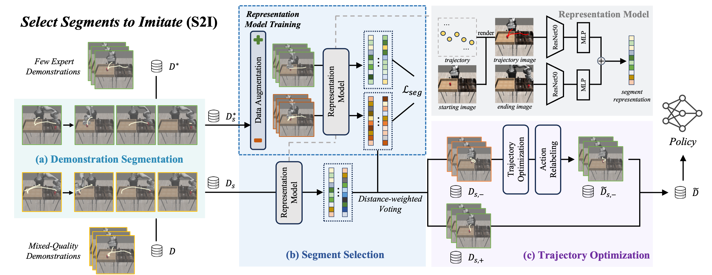

## Towards Effective Utilization of Mixed-Quality Demonstrations in Robotic Manipulation via Segment-Level Selection and Optimization

### Run
For the representation model training stage, run the command `bash command_train.sh` to execute the data training script, which will preprocess the dataset and training the model. 

Here are the argument explanations in the training process:
* `--dataset` : Specifies the entire dataset used for the representation model training.
* `--aug_path` : The path where the results of the augmented dataset will be stored. 
* `--save_mode` ：Indicates the format or type of the dataset.
* `--size` : Specifies the size to which the images will be resized.
* `--numbers` ：The index or specific identifier used for data augmentation within the dataset. 

For the eval stage, run the command `bash command_eval.sh` to complete the segment selection and trajectory optimization processes.

Here are the argument explanations in the evaluation process:
* `--train_data_folder` :  The dataset used for distance-weighted voting during the segment selection process.
* `--val_data_folder` : The folder containing the full mixed-quality demonstration dataset for validation.
* `--size` : Specifies the size to which the images will be resized.
