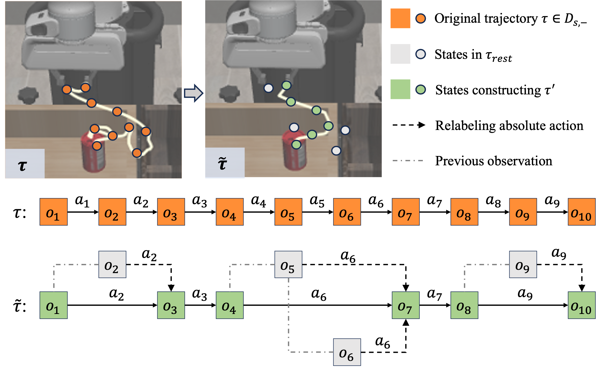

# Manipulation Policy
## BC-RNN
For state-based [BC-RNN](https://github.com/ARISE-Initiative/robomimic), we modified the rollout program to ensure that during simulation evaluation, 50 starting positions are randomly selected. These positions vary across different seeds but remain consistent within the same seed.

Here are the argument explanations in the rollout process:
* `--config` : Specifies the configuration for the algorithm's structure.
* `--dataset` : The path to the dataset used for training and loading environment parameters.
* `--checkpoint_dir` : The directory containing the checkpoints to be evaluated.

## Diffusion Policy

    

For the [diffusion policy](https://github.com/real-stanford/diffusion_policy) method, we slightly modified the sampling process to align with the action relabeling procedure. Specifically, we adjusted the sampling to ensure that each sampled state corresponds to its preceding state and action, matching the process depicted in the action relabeling diagram.